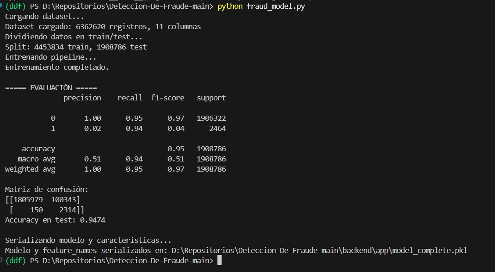

  

# 💡 FraudVision  
### Detección Inteligente de Fraude en Transacciones Financieras

**FraudVision** combina machine learning supervisado y no supervisado con una API web ligera para detectar patrones fraudulentos en tiempo real. Diseñado para instituciones financieras, e‑commerce y plataformas de pago.

---

## 🚀 Características Principales

- **Modelo Híbrido de Detección**  
  Fusiona algoritmos XGBoost, clustering y reglas estadísticas para maximizar precisión.  
- **Análisis en Tiempo Real**  
  Respuestas instantáneas a cada transacción mediante una API REST escalable.  
- **Interfaz Web Intuitiva**  
  Sube CSVs o ingresa transacciones puntuales y visualiza reportes y gráficas.  
- **Despliegue Flexible**  
  Compatible con Render, Docker, Kubernetes y cloud providers (AWS, GCP, Azure).

---

## ⚙️ Cómo Funciona (Workflow)

1. **Entrenamiento & Serialización**  
   — Entrena tu modelo con `training.ipynb` y genera `model.pkl`.  
2. **Despliegue de la API**  
   — Configura `render.yaml` (o tu Dockerfile).  
   — `git push` para desplegar en Render.com.  
3. **Consumir el Servicio**  
   - **REST**: `POST /predict` con payload JSON de transacción.  
   - **Web**: Interfaz gráfica en `/` para subir archivos y consultar resultados.  

---

## 🎯 Casos de Uso

| Escenario                 | Beneficio Clave                                   |
|---------------------------|---------------------------------------------------|
| **Banca**                 | Reducir pérdidas por fraudes en tiempo real.      |
| **E‑commerce**            | Disminuir chargebacks y proteger a tus clientes.  |
| **FinTech / Wallets**     | Blindar tus plataformas de pago contra abusos.    |

---

## 💎 ¿Por Qué FraudVision?

- **Alta Precisión:** F1‑Score > 97 %.  
- **Fácil Integración:** 3 endpoints: `/`, `/predict`, `/metrics`.  
- **Open Source:** Extiende y adapta al 100 %.  
- **Deployment Ready:** Demo online y CI/CD lista para usar.

---

## 🛣️ Próximos Pasos

- Integrar sistemas de **alertas** (Slack, email).  
- Añadir **autohandling** de datos faltantes y drift detection.  
- Soporte para **streaming** (Kafka, Kinesis).

---

**Demo Online:** [fraudvision.onrender.com](https://fraudvision.onrender.com/)  
**Contacto:** datastudioasteroids@gmail.com  
